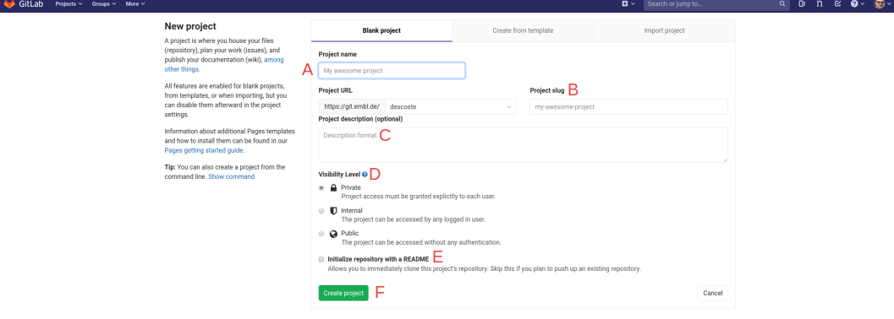
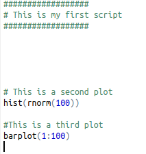

# Introduction to git

## Table of content

1. [Introduction](#introduction)
2. [Getting started](#getting-started)
    * [Demo](#demo)
    * [First steps on embl git](#first-steps-on-embl-git)
3. [Rstudio](#rstudio)
    * [Demo 2](#demo-2)
    * [Git in Rstudio](#git-in-rstudio)

**Contributors:** Nicolas Descostes and Toby Hodges

**Credits:** This content is largely based on the [GBCS](https://gbcs.embl.de/portal/tiki-index.php) [tutorial](https://gbservices.embl.de/git-conda/) and the [Software Carpentry](https://software-carpentry.org/) [tutorial](https://swcarpentry.github.io/git-novice/). 
The Software Carpentry content being under CC-BY 4.0 license and GBCS having kindly given their authorization to use their material, a lot of the material in this workshop are just copied/pasted.

 
## Introduction

**Slides:** [intro](pdf/intro.pdf)

Let's begin by having a look at what a life without git looks like:

[1](https://medium.com/@fredrick.adegoke/version-control-systems-source-code-banking-efcbb9272aee)

[2](http://www.phdcomics.com)

Git can not only prevent you experiencing these situations but also help you programming more efficiently:

[3](http://www.phdcomics.com)

Version control systems start with a base version of the document and then record changes you make each step of the way. You can think of it as a recording of your progress: you can rewind to start at the base document and play back each change you made, eventually arriving at your more recent version.

Once you think of changes as separate from the document itself, you can then think about “playing back” different sets of changes on the base document, ultimately resulting in different versions of that document. For example, two users can make independent sets of changes on the same document. Git enables collaborative work! Several people can work on the same document or the same program!

Unless multiple users make changes to the same section of the document - a conflict - you can incorporate two sets of changes into the same base document.

A version control system is a tool that keeps track of these changes for us, effectively creating different versions of our files. It allows us to decide which changes will be made to the next version (each record of these changes is called a commit), and keeps useful metadata about them. The complete history of commits for a particular project and their metadata make up a repository. Repositories can be kept in sync across different computers, facilitating collaboration among different people.

Automated version control systems are nothing new. Tools like RCS, CVS, or Subversion have been around since the early 1980s and are used by many large companies. However, many of these are now considered legacy systems (i.e., outdated) due to various limitations in their capabilities. More modern systems, such as Git and Mercurial, are distributed, meaning that they do not need a centralized server to host the repository. These modern systems also include powerful merging tools that make it possible for multiple authors to work on the same files concurrently.

**Key points:**
  * Version control is like an unlimited ‘undo’.
  * Version control also allows many people to work in parallel.

## Getting started

### Demo

**Live demo of the content of the next section.**

### First steps on embl git

#### 1. Connect to **git.embl.de** and use your regular login and password.

#### 2. Explore the welcome page

  * A: By default, all the projects of all the groups that you are involved in are displayed on this page. **A project is also called a 'repository'.**
  * B: This tab will restrict the view to the projects that you are involved in as a maintainer, a developper or other.
  * C: Search bar, search for a particular project by keywords.
  * D: Create a new project (see below).

  
#### 3. Explore projects

  * A: Click on All to see all **repositories** hosted at EMBL. You can also filter these projects by 'Trending' or 'Most stars' features (on the left side of the 'All' tab).
  * B: Display the repositories by 'last updated', 'name', 'oldest updated', and other criteria.
  * C: Display the repositories whether they are 'public', 'internal' or 'private'.
  * D: The 'New project' icon is always accessible from the interface (see next step). Now click on it and follow the next steps.

  
#### 4. Create a new project
  

  * A: Enter your project name such as 'Demo Repo'.
  * B: A repository slug is a URL-friendly version of a repository name, you can see that upper-case letters and space were removed ('demo-repo').
  * C: Enter a description of the repository such as 'first creation of a git repository'. This will be displayed under your repository name on the welcome page.
  * D: Choose the visibility level of the repository. 'private' means that only you and other owners (that you could invite) can see the repository; 'internal' means that only people from embl can see the repository; and 'public' makes the repository readable to anybody.
  * E: Initialize the repository with a markdown document called 'README.md'. **Select this option**. The description (see point C) and the title of your repository will appear in this document by default.
  * F: Click 'Create project'.

#### 5. Explore the repository interface

  * A: Title of the repository. The lock icon indicates that the repository is private.
  * B: You will see later on what *commit* and *branches* mean. Aside from the indicated size of the repository (113 Kb; depending on the files stored in it), you can add a license (defining the conditions of utilization of your documents and code) and some searchable tags.
  * C: The bell icon enables to define how you should be notified concerning modifications made to the repository. Star is functionning as 'likes' on twitter or facebook. The fork button enables you to clone any (non-private) repository in order to modify it. The clone button is what you will use to import the repository on your computer or in a development interface (see next part on using git in RStudio).
  * D: Indicate the branch on which you are (see below on how to create and use branches). The current branch is called 'master'. The '+' icon enables to add new files or folders; you will almost never use this button. The 'History' (on the right) displays modifications made on your repository and the 'down arrow' icon is a download button. You can save your entire repository in a zip file on your localm computer.
  * E: This secton contains all the folders and files of your repository. For the moment there is only one file: 'README.md'. The 'Last commit' column displays the last modification message for each file. 'Last update' indicates when a particular modification happened.
  * F: The README file, it is usually used to create the documentation of your repository.  

#### 6. Edit README.md

Click on README.md and hit the 'Edit' button:

#### 7. Modify and commit

  * A: Indicate the edited file.
  * B: Modificaton of the document. Here the sentence is 'Doing my first modification'.
  * C: Describe the modification that you want to save such as 'adding the sentence -doing my first modification-'.
  * D: Branch on which the commit is done. Here is the master branch.
  * E: Hit 'Commit changes', the "commit" command is used to save your changes to the local repository. 

#### 8. Explore modifications

  * A: The number of commits changed from 1 to 2. The first one was the original commit when creating the repository; it was 'initial commit'. The second one is the one that you just did.
  * B: You can now see that the commit "adding the sentence 'Doing my first modification'" was done 27 minutes ago.
  * C: The actual modification.
  
Now perform two edits to the document: 
  * Add "Doing my second modification."
  * Remove 'Doing my first modification' and add 'Doing my third modification'.

#### 9. Explore the history

Click the 'History' button:

You can see a list of modifications that were made on your repository. Click on the most recent one at the top of the list.

You can appreciate now all additions or deletions that were made to your document:

  * A: At the top left, you can read that for this particular commit, 3 additions and 1 deletion were made. You can change the representation or hide whitespace changes with the top right buttons.
  * B: The red color represents deletions. The line 5 was removed.
  * C: Green represents additions. Line 5, 8 and 9 were added to the document.
  
Display changes in a direct comparison with the previous commit by clicking the icon 'Side-by-side':

Finally, you can visualize all commits with their messages using the 'blame' button. Go to the welcome page of your repository, click on 'README.md' and then 'Blame' on the top right:

You should obtain the interface below:

#### Conclusion

  This section aimed at giving you a first impression of how git/version control works. As you can imagine git can enable you to do much more than this! In the following section, we will see how to use git in Rstudio.

## Rstudio

### Demo 2

**Live demo of the content of the next section.**

### Git in Rstudio

#### 1. Create a new repository on gitlab called 'rstudio demo'

**Initialize the repository with a README**. Copy the html address of the repository using the 'clone icon'.

#### 2. Connect to Rstudio

Go to the [EMBL Rstudio webpage](https://rstudio.embl.de/auth-sign-in) and authenticate using your EMBL login and password:

#### 3. Create a new project in Rstudio

Click 'Version control':

Click 'git':

Enter the repository HTTPS URL and select 'open in new session'. Hit 'Create project''.

You should see the following interface:

  * A: This tool bar contains the important tools for managing your git. We have already seen what **commit** aims for. You will see below how to use Diff, pull, push and history.
  * B: Shows the files of the current repository that are not yet committed. The .gitignore file defines files that should not be commited (and pushed) to the repository.
  * C: Notice that the project is created in your home folder. **Since the space in this folder is limited, you might want to move it to another location**.
  * D: Shows the files of the repository (wether or not they are commited).  

#### 4. Commit your changes

Create a new R script:

Modify it as follows and save it as 'firstscript'.

You should obtain the following interface:

  * A: The just created script.
  * B: The script now appears in the git window.
  * C: The script now appears in the repository window.

Select all files in the git window and hit 'commit':

Enter 'initial commit' for the commit message and hit 'commit':

The files now disappeared in the git window.

#### 5. Push your changes

Go back to your repository on gitlab and refresh the page. You should see that nothing changed. This is because the files were committed locally. You need now to **push** them to the repository. To do so, click the push button in the
rstudio interface:

#### 6. Explore differences

Let's begin by doing the following modification to the script:

Commit this change as before by clicking 'commit'. 

You can see that the added lines are highlighted in green and the removed one in red. Click commit and then directly press 'push' on the top right corner.

You can see each modification that you did through the 'history' icon:

Let's add a third plot to our script and remove the first one:

You can visualize all the difference that you made before committing and pushing your changes with 'Diff'.

In the same way as before, you can see changes highlighted in red and green:

**Now commit and push your changes**.

#### 7. Retrieve modifications with pull

Let's imagine that you are collaborating on a project. Before starting coding, you want to make sure that your repository is up-to-date by integrating the modifications that others did. Let's first pretend that you are this collaborator.
Go to your repository, click firstscript.R and 'edit'. Add a fourth plot to the script:

If you now look at your history in the rstudio interface, the change that you just have made will not appear. In order to import it, click 'pull':

The modification that you did directly on gitlab should now be visible on your script section and in your history:

 

~~~~~~~~~~~~~~~~~~~~~~~~~~~~~~~~~~~~~~~~~~~~~~~~~~~~~~~~~~~~~~~~~~~~~~~~~~~~~~~~~~~~

## The GitLab Interface & First Steps

- log into git.embl.de
- show an example project
  - highlight key parts of project interface
  - show project history timeline
  - show blame for a single file
  - show how to view older versions of a file
- create a project from scratch
- add a README.md
- introduce basics of Markdown
- make a change to README via web interface
- commit and explain commit message
- repeat
- add new file(s)

## Working on the command line

- navigate to relevant directory
- clone repo && cd into project directory
- change global settings
  - `git config --global user.name`
  - `git config --global user.email`
  - `git config --global core.editor "nano -w"`
- mention `git init` - demo this at the end of day
- `git status`
- `git log`
- edit/create a file
- `git add`
- `git commit`
  - (if necessary) more about commit messages
  - imagine your future self as a collaborator, who won't know (remember) why you made the changes you're making
- make another change
- `git add`
- `git commit -m`
- mention `git commit -a` & warn about hazards of using it
- `git log`
  - `git log -N`
  - `git log --oneline`
  - `git log --patch <filename>`
- `git diff`
  - `git add + git diff --staged`
  - `git diff --color-words`
  - `git diff HEAD~2 <filename>`
  - `git diff <commithash> <filename>`
- `git checkout HEAD` to revert to most recent committed state
  - `git checkout HEAD <filename>` to achieve the same thing with a single file
- detached head!
  - `git checkout <commithash>` (forgetting filename)
  - `git checkout master` to recover from this
- `.gitignore`
- remotes
  - `git remote`
  - `git push origin master`
  - make a change on GitLab
  - `git pull origin master`
- collaboration exercises
 