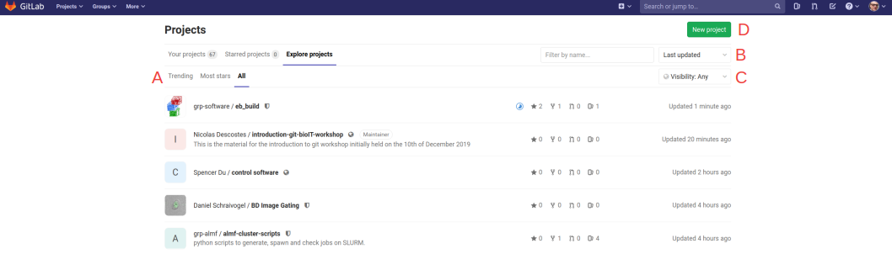

# Introduction to git

## Table of content

1. [Introduction](#introduction)
2. [Getting started](#getting-started)
    * [demo](#demo)
    * [First steps on embl git](#first-steps-on-embl-git)

**Contributors:** Nicolas Descostes and Toby Hodges

**Credits:** This content is largely based on the [GBCS](https://gbcs.embl.de/portal/tiki-index.php) [tutorial](https://gbservices.embl.de/git-conda/) and the [Software Carpentry](https://software-carpentry.org/) [tutorial](https://swcarpentry.github.io/git-novice/). 
The Software Carpentry content being under CC-BY 4.0 license and GBCS having kindly given their authorization to use their material, a lot of the material in this workshop are just copied/pasted.

 
## Introduction

**Slides:** [intro](pdf/intro.pdf)

Let's begin by having a look at what a life without git looks like:

[1](https://medium.com/@fredrick.adegoke/version-control-systems-source-code-banking-efcbb9272aee)

[2](http://www.phdcomics.com)

Git can not only prevent you experiencing these situations but also help you programming more efficiently:

[3](http://www.phdcomics.com)

Version control systems start with a base version of the document and then record changes you make each step of the way. You can think of it as a recording of your progress: you can rewind to start at the base document and play back each change you made, eventually arriving at your more recent version.

Once you think of changes as separate from the document itself, you can then think about “playing back” different sets of changes on the base document, ultimately resulting in different versions of that document. For example, two users can make independent sets of changes on the same document. Git enables collaborative work! Several people can work on the same document or the same program!

Unless multiple users make changes to the same section of the document - a conflict - you can incorporate two sets of changes into the same base document.

A version control system is a tool that keeps track of these changes for us, effectively creating different versions of our files. It allows us to decide which changes will be made to the next version (each record of these changes is called a commit), and keeps useful metadata about them. The complete history of commits for a particular project and their metadata make up a repository. Repositories can be kept in sync across different computers, facilitating collaboration among different people.

Automated version control systems are nothing new. Tools like RCS, CVS, or Subversion have been around since the early 1980s and are used by many large companies. However, many of these are now considered legacy systems (i.e., outdated) due to various limitations in their capabilities. More modern systems, such as Git and Mercurial, are distributed, meaning that they do not need a centralized server to host the repository. These modern systems also include powerful merging tools that make it possible for multiple authors to work on the same files concurrently.

**Key points:**
  * Version control is like an unlimited ‘undo’.
  * Version control also allows many people to work in parallel.

## Getting started

### Demo

**Live demo of the content of the next section.**

### First steps on embl git

1. Connect to **git.embl.de** and use your regular login and password.

2. Explore the welcome page

  * A: By default, all the projects that you are involved in are displayed on this page. **A project is also called a 'repository'.**
  * B: When creating a project, you can define access rights (**private, internal, public**; see below). This tab will restrict the view to your projects that are **private**.
  * C: Search bar, search for a particular project by keywords.
  * D: Create a new project (see below).
  
3. Explore projects

  * A: Click on All to see all **repositories** hosted at EMBL. You can also filter these projects by 'Trending' or 'Most stars' features.
  * B: Display the repositories by 'last updated', 'name', 'oldest updated', and other criteria.
  * C: Display the repositories whether they are 'public', 'internal' or 'private'.
  * D: The 'New project' icon is always accessible from the interface (see next step).
  
4. Create a new project
  

A repository slug is a URL-friendly version of a repository name,

~~~~~~~~~~~~~~~~~~~~~~~~~~~~~~~~~~~~~~~~~~~~~~~~~~~~~~~~~~~~~~~~~~~~~~~~~~~~~~~~~~~~

## The GitLab Interface & First Steps

- log into git.embl.de
- show an example project
  - highlight key parts of project interface
  - show project history timeline
  - show blame for a single file
  - show how to view older versions of a file
- create a project from scratch
- add a README.md
- introduce basics of Markdown
- make a change to README via web interface
- commit and explain commit message
- repeat
- add new file(s)

## Working on the command line

- navigate to relevant directory
- clone repo && cd into project directory
- change global settings
  - `git config --global user.name`
  - `git config --global user.email`
  - `git config --global core.editor "nano -w"`
- mention `git init` - demo this at the end of day
- `git status`
- `git log`
- edit/create a file
- `git add`
- `git commit`
  - (if necessary) more about commit messages
  - imagine your future self as a collaborator, who won't know (remember) why you made the changes you're making
- make another change
- `git add`
- `git commit -m`
- mention `git commit -a` & warn about hazards of using it
- `git log`
  - `git log -N`
  - `git log --oneline`
  - `git log --patch <filename>`
- `git diff`
  - `git add + git diff --staged`
  - `git diff --color-words`
  - `git diff HEAD~2 <filename>`
  - `git diff <commithash> <filename>`
- `git checkout HEAD` to revert to most recent committed state
  - `git checkout HEAD <filename>` to achieve the same thing with a single file
- detached head!
  - `git checkout <commithash>` (forgetting filename)
  - `git checkout master` to recover from this
- `.gitignore`
- remotes
  - `git remote`
  - `git push origin master`
  - make a change on GitLab
  - `git pull origin master`
- collaboration exercises
 